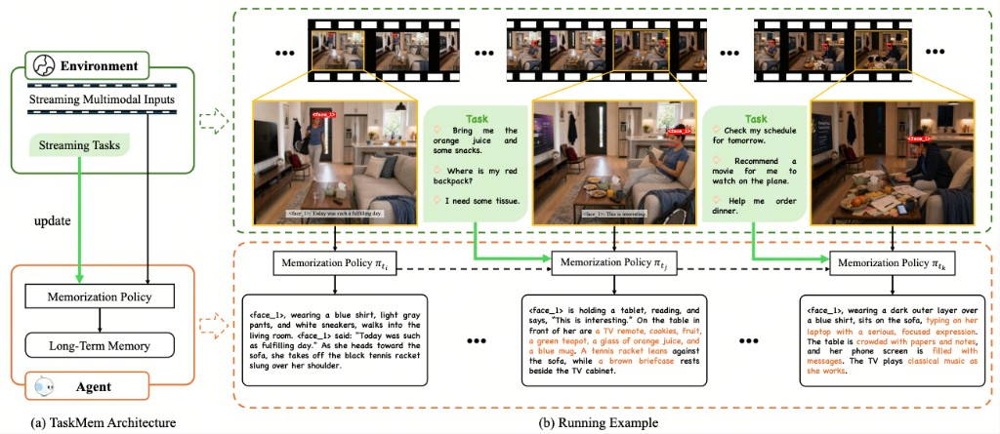
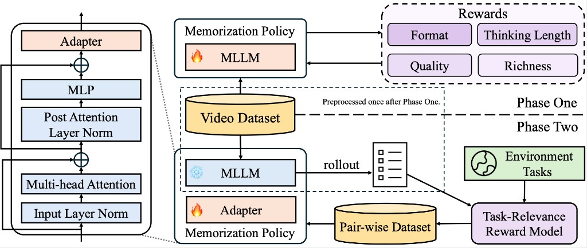

# Task-Focused Memorization for Multimodal Agents

[arXiv (coming soon)](#) | [Demo](https://hope-rita.github.io/TaskMem-demo/) | [Model (coming soon)](#) | [Data (coming soon)](#) | [Phase One](https://github.com/Hope-Rita/TaskMem-PhaseOne) | [Phase Two](https://github.com/Hope-Rita/TaskMem-PhaseTwo)

> This repository is the **inference framework** of TaskMem: given a video and
> a TaskMem checkpoint, it streams the video clip-by-clip, builds episodic
> long-term memory, and runs streaming-memory QA evaluation. Training of the
> memorization policy is released as two companion repositories:
> [**TaskMem-PhaseOne**](https://github.com/Hope-Rita/TaskMem-PhaseOne) for
> Phase One RL, and
> [**TaskMem-PhaseTwo**](https://github.com/Hope-Rita/TaskMem-PhaseTwo) for
> Phase Two DPO that produces the steer-adapter weights consumed here.



> **(a) TaskMem Architecture.** An agent receives streaming multimodal
> inputs and streaming tasks from the environment, and continually updates
> its long-term memory through a learned **memorization policy**.
> **(b) Running Example.** Tasks arriving at different time steps shift
> the focus of the memorization policy
> $\pi_{t_i} \to \pi_{t_j} \to \pi_{t_k}$, so the same scene is
> memorized in different ways depending on what the agent will be asked.

## Abstract

Long-term memory is essential for multimodal agents to build coherent experience, accumulate world knowledge, and achieve continual learning. However, constructing effective memory goes beyond memory module design and basic requirements such as accuracy and fidelity; the key challenge lies in determining **what to memorize**. Multimodal agents, such as embodied agents, continuously perceive, reason, and act in real or virtual environments, receiving an unbounded stream of multimodal observations. From this combinatorial explosion of information, an agent must selectively retain content that is relevant to its role in the environment and valuable for future tasks. To bridge this gap, we frame memory generation as a learnable memorization policy and introduce **TaskMem (Task-focused Memorization Policy Learning)**, a reinforcement-learning-based framework that enables the policy to dynamically adjust its focus to the demands of real tasks encountered in the environment. TaskMem adopts a two-phase training paradigm: **Phase One** learns *how* to memorize by optimizing memory quality under fundamental fidelity requirements; **Phase Two** occurs after deployment, where the agent learns *what* to memorize by tuning an adapter on its base MLLM, using recent environment tasks to define a reward model that guides the memorization policy toward task-relevant content. To evaluate our approach, we reformulate VideoMME, EgoLife, and EgoTempo into **streaming benchmarks** that simulate a realistic setting in which an agent processes streaming observations and handles tasks arriving online. To isolate memory assessment, the questions must be answered using only the agent's memory, without access to raw video. Built on **Qwen3-VL-30B-A3B**, TaskMem improves VQA accuracy by **6.3%**, **7.0%**, and **5.3%** on these benchmarks, respectively.

## Method



> **Phase One** trains the memorization policy on a frozen video dataset
> against fidelity-style rewards — **Format**, **Thinking Length**,
> **Quality** and **Richness** — to learn *how* to memorize.
> **Phase Two** keeps the base MLLM frozen and tunes a lightweight
> **Adapter** (inserted after every transformer block) on preference pairs
> derived from the deployment environment's **Task-Relevance Reward
> Model**, teaching the policy *what* to memorize for the tasks it will
> actually face.

## Streaming-Memory Benchmarks

We reformulate three popular long-video QA benchmarks into a streaming-memory
setting: the agent watches the video as a stream, writes long-term memory on
the fly, and then has to answer questions **using only its memory** — the raw
video is no longer available at QA time. This isolates the evaluation of the
memorization policy itself, separating it from the downstream reasoner.

| Benchmark | Setting | Question style |
| --- | --- | --- |
| Video-MME (streaming) | mixed-domain web videos | multiple-choice |
| EgoLife (streaming) | multi-day egocentric | multiple-choice |
| EgoTempo (streaming) | egocentric, temporally-dense | free-form |

## Experimental Results

<table>
  <thead>
    <tr>
      <th rowspan="2">Method</th>
      <th colspan="3" align="center">Video-MME</th>
      <th colspan="3" align="center">EgoLife</th>
      <th colspan="3" align="center">EgoTempo</th>
    </tr>
    <tr>
      <th align="right">Acc.</th><th align="right">Cov.</th><th align="right">Prec.</th>
      <th align="right">Acc.</th><th align="right">Cov.</th><th align="right">Prec.</th>
      <th align="right">Acc.</th><th align="right">Cov.</th><th align="right">Prec.</th>
    </tr>
  </thead>
  <tbody>
    <tr><td>EgoGPT</td>           <td align="right">44.3</td><td align="right">58.7</td><td align="right">75.5</td><td align="right">19.2</td><td align="right">28.2</td><td align="right">68.1</td><td align="right">15.0</td><td align="right">33.5</td><td align="right">44.9</td></tr>
    <tr><td>HippoMM</td>          <td align="right">48.9</td><td align="right">66.6</td><td align="right">73.5</td><td align="right">30.4</td><td align="right">43.4</td><td align="right">70.0</td><td align="right">15.8</td><td align="right">30.8</td><td align="right">51.1</td></tr>
    <tr><td>M3-Agent</td>         <td align="right">62.5</td><td align="right">77.7</td><td align="right">80.4</td><td align="right">21.8</td><td align="right">30.8</td><td align="right">70.8</td><td align="right">16.0</td><td align="right">36.3</td><td align="right">44.2</td></tr>
    <tr><td>Gemini-1.5-Pro</td>   <td align="right">55.3</td><td align="right">65.9</td><td align="right">83.9</td><td align="right">39.4</td><td align="right">51.6</td><td align="right">76.4</td><td align="right">19.7</td><td align="right">34.3</td><td align="right">57.4</td></tr>
    <tr><td>Gemini-2.5-Pro</td>   <td align="right">63.2</td><td align="right">74.8</td><td align="right">84.4</td><td align="right">43.8</td><td align="right">56.6</td><td align="right">77.4</td><td align="right">25.8</td><td align="right">42.3</td><td align="right">61.0</td></tr>
    <tr><td>GPT-5.2</td>          <td align="right">67.3</td><td align="right">80.8</td><td align="right">83.3</td><td align="right">34.8</td><td align="right">48.2</td><td align="right">72.2</td><td align="right"><b>32.1</b></td><td align="right">51.4</td><td align="right">62.4</td></tr>
    <tr><td>Qwen3-VL-30B-A3B</td> <td align="right">61.6</td><td align="right">74.7</td><td align="right">82.5</td><td align="right">38.4</td><td align="right">52.4</td><td align="right">73.3</td><td align="right">22.3</td><td align="right">38.9</td><td align="right">57.2</td></tr>
    <tr><td><b>TaskMem (Ours)</b></td><td align="right"><b>67.9</b></td><td align="right">79.3</td><td align="right"><b>85.6</b></td><td align="right"><b>45.4</b></td><td align="right">56.4</td><td align="right"><b>80.5</b></td><td align="right">27.6</td><td align="right">43.7</td><td align="right"><b>63.2</b></td></tr>
  </tbody>
</table>

See the [project page](https://hope-rita.github.io/TaskMem-demo/) for the
full table and a live demo.

## Run Locally (Inference)

This repository runs the **memorization pipeline at inference time**: it
takes a raw video, streams it clip-by-clip, and builds an episodic
long-term memory that downstream QA can consume. We support two
deployment scenarios:

- **Scenario A — Baseline (no adapter):** a fast-to-stand-up pipeline
  built around an off-the-shelf VLM (Gemini, GPT, or vanilla Qwen3-VL).
  Use this to sanity-check the pipeline, reproduce baselines, or run
  TaskMem on a machine without a GPU plugin.
- **Scenario B — TaskMem (with steer adapter):** the full TaskMem
  configuration that matches the numbers reported in the paper. Loads a
  Phase-Two checkpoint (base Qwen3-VL-30B-A3B + steer adapter) via the
  bundled vLLM plugin.

Both scenarios share the same QA / evaluation scripts and the same
`src/main.py` driver; they differ only in which episodic backend is
loaded and whether the steer-adapter vLLM plugin is enabled.

### 1. Install

```bash
git clone <repo-url>
cd taskmem-inference

# Shared base install (required for both scenarios).
bash setup.sh

# Scenario B only: additionally build the CUDA vLLM stack and register
# the qwen3vllm_ada plugin.
bash vl_setup.sh
pip install -e .
```

`bash setup.sh` installs the lightweight Python deps that both
scenarios need (`moviepy`, `pydub`, `hdbscan`, `insightface`,
`json-repair`, `openai`) plus the `ffmpeg` system package. It does
**not** build vLLM — Scenario A on Gemini doesn't need it.

`bash vl_setup.sh` is the heavyweight Scenario-B add-on: CUDA PyTorch,
flash-attn, and a standard vLLM that supports Qwen3-VL. It assumes
`setup.sh` has already been run for the shared dependencies and
`ffmpeg`.

`pip install -e .` is **only required for Scenario B**. It installs
`setup.py`'s `vllm.general_plugins` entry point so that
`VLLM_PLUGINS=qwen3vllm_ada` activates the steer-adapter version of the
Qwen3-VL model at load time.

### 2. Configure the LLM judge

Copy the template, fill in your credentials, and point
`TASKMEM_API_CONFIG` at it:

```bash
cp configs/api_config.json configs/api_config.local.json
export TASKMEM_API_CONFIG=configs/api_config.local.json
```

Required for both scenarios out of the box, because the default ASR /
voice / baseline-episodic backends are all Gemini, and because all QA
evaluation scripts call an LLM judge.

---

### Scenario A — Baseline (no adapter)

End-to-end on a single video with an off-the-shelf VLM. No vLLM plugin
required, no checkpoint to download.

```bash
export VIDEO_PATH=./data/videos/demo.mp4
export OUTPUT_FOLDER=./out/demo

# Default: Gemini for ASR / voice / episodic. API-only, no GPU required;
# expects TASKMEM_API_CONFIG to be set.
bash examples/run_baseline.sh

# Optional: vanilla Qwen3-VL (local vLLM) for the episodic step.
EPISODIC_MODEL=qwen3_vl_vllm \
EPISODIC_MODEL_PATH=Qwen/Qwen3-VL-30B-A3B-Thinking \
    bash examples/run_baseline.sh
```

The script runs three `src/main.py` invocations: (1) `--process_audio`
for ASR + diarization, (2) `--process_video --process_voice` for face
detection, speaker matching, and per-clip mp4 rendering, and (3)
`--generate_episodic` to turn the per-clip context into episodic memory.

### Scenario B — TaskMem (with steer adapter)

Same pipeline as Scenario A, except the episodic step now goes through
vLLM with the steer-adapter plugin enabled and a Phase-Two checkpoint
loaded.

```bash
export VIDEO_PATH=./data/videos/demo.mp4
export OUTPUT_FOLDER=./out/demo
export TASKMEM_CKPT=/path/to/taskmem_phase2_ckpt

bash examples/run_taskmem.sh
```

`TASKMEM_CKPT` is a HuggingFace-format directory produced by
[**TaskMem-PhaseTwo**](https://github.com/Hope-Rita/TaskMem-PhaseTwo)
that bundles the base Qwen3-VL-30B-A3B-Thinking weights with the
trained steer adapter. The script sets the necessary vLLM env vars
(`VLLM_PLUGINS=qwen3vllm_ada`, `VLLM_USE_V1=1`, etc.) before launching
`src/main.py`. `ADA_TRAIN_LAYERS` defaults to `22` to match the
released Phase-Two checkpoint; only override it if you trained your own
adapter on a different layer (e.g. `ADA_TRAIN_LAYERS=22,23,24`).

After either scenario finishes you get
`$OUTPUT_FOLDER/<video_id>_<WRITE_TAG>.pkl`, a `LongTermMemory` object
whose `to_string("episodic")` renders the episodic memory text consumed
by the QA scripts below.

---

### Question Answering and Evaluation

Every QA script loads the judge LLM credentials via
`TASKMEM_API_CONFIG`. The `--memory_tag` / `--memory_name` flag must
match the `WRITE_TAG` used during memory generation (`baseline_ep` for
Scenario A, `taskmem_ep` for Scenario B).

```bash
# Video-MME (multiple-choice)
python test/test_videomme_qa.py \
    --memory_folder ./out/videomme \
    --video_info_root ./data/videomme/info \
    --memory_name taskmem_ep --memory_type episodic

# EgoLife (multiple-choice, multi-day egocentric)
python test/test_egolife_qa.py \
    --qa_file ./data/egolife_qa.json \
    --memory_root ./out/egolife \
    --memory_tag taskmem_ep --memory_type episodic \
    --output_file ./out/results/egolife_taskmem.jsonl

# EgoTempo (free-form, LLM-judged)
python test/test_egotempo_qa.py \
    --memory_folder ./out/egotempo \
    --video_info ./data/egotempo/video_info.json \
    --memory_name taskmem_ep --memory_type episodic
```

### Supported Backends

| Identifier | Backend | Used as |
| --- | --- | --- |
| `gemini-*`, `gpt-*` | OpenAI-compatible API (`TASKMEM_API_CONFIG`) | `--asr_model` (default `gemini-2.5-pro`), `--voice_model` (default `gemini-2.5-pro`), `--episodic_model` (default `gemini-2.5-flash`) |
| `qwen3_vl_vllm` | local vLLM | `--episodic_model`: vanilla Qwen3-VL-30B-A3B in Scenario A, **or** the TaskMem steer-adapter checkpoint in Scenario B |

### Pluggable Face / Speaker Backends

Face detection / embedding / clustering runs locally by default using
[insightface](https://github.com/deepinsight/insightface) (RetinaFace +
ArcFace) and [HDBSCAN](https://hdbscan.readthedocs.io/). Point the following
env vars at a Python module to swap in a different stack:

| Env var | Default | Callable |
| --- | --- | --- |
| `TASKMEM_FACE_BACKEND` | `tools.face_extraction` | `extract_faces(frames) -> list[dict]` |
| `TASKMEM_FACE_CLUSTER_BACKEND` | `tools.face_clustering` | `cluster_faces(faces, min_cluster_size) -> list[dict]` |

For optional cross-clip speaker re-identification via voiceprint
embeddings, set `TASKMEM_AUDIO_EMBED_BACKEND=your_pkg.your_module`,
where the module exposes
`get_audio_embeddings(wav_b64_list) -> list[list[float] | None]`.
When unset (the default), per-clip face↔voice matching is still done
by the VL model, but "unknown" speakers will not be re-identified
across clips.

## Training

Training of the TaskMem episodic memorization policy is released as two
separate repositories.

| Stage | Repository | What it does |
| --- | --- | --- |
| **Phase One** | [Hope-Rita/TaskMem-PhaseOne](https://github.com/Hope-Rita/TaskMem-PhaseOne) | RL training of the base episodic policy on top of Qwen3-VL-30B-A3B-Thinking (verl + GSPO, multi-reward judge). |
| **Phase Two** | [Hope-Rita/TaskMem-PhaseTwo](https://github.com/Hope-Rita/TaskMem-PhaseTwo) | DPO training of a lightweight **steer adapter** on preference pairs scored by the task-relevance reward model; produces the HuggingFace-format checkpoint consumed by `examples/run_taskmem.sh`. |

The `training/` directory in this repository contains the **data-preparation
scripts** that produce the parquet/jsonl files those two training pipelines
consume — they are not training loops themselves. The `modeling/` directory
provides the adapter-aware HuggingFace + vLLM model classes shared between
this inference framework and Phase Two; the vLLM version is registered as
the `qwen3vllm_ada` plugin via `setup.py`.

## Citation

```bibtex
@inproceedings{zou2026taskmem,
  title  = {Task-Focused Memorization for Multimodal Agents},
  author = {Zou, Tao and He, Yichen and Qiu, Tian and Lin, Yuan and Li, Hang},
  year   = {2026},
  url    = {https://hope-rita.github.io/TaskMem-demo/}
}
```

## License

Apache License 2.0. See [`LICENSE`](LICENSE).
